При запуске программа предлагает перейти на страницу http://127.0.0.1:5000/ переход на которую открывает главную HTML-страницу библиотеки:

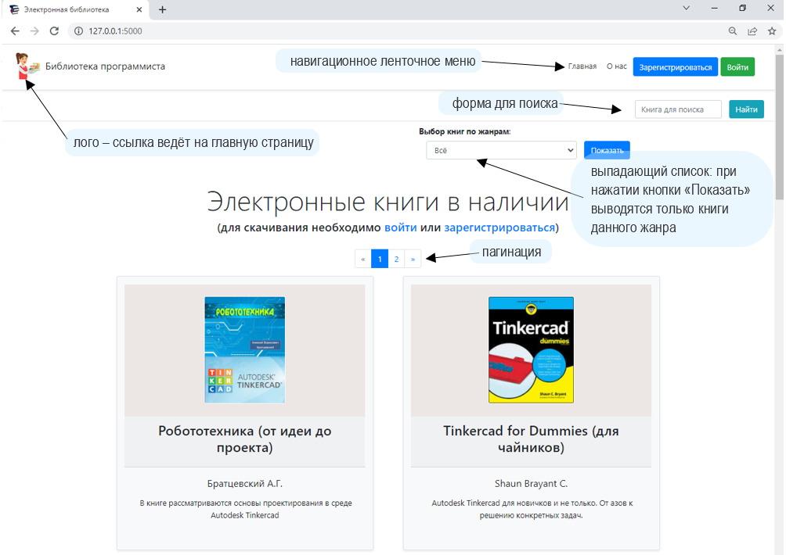

Для вывода книг, поиска, ранжирования по жанрам, авторизации и назначения уровня прав доступа организована база данных, состоящая из 4 основных таблиц:

1. books – собственно таблица, содержащая необходимые поля для хранения и визуализации книг:
* Номер (id);
* Название (title);
* Автор (author);
* Жанр (genre, точнее его id из таблицы genres);
* Описание (description);
* Имя файла обложки (cover) для подгрузки из /static/covers;
* Имя PDF-файла книги (pdf) для скачивания из /static/pdf;
* Доступ к книге (is_private) - в текущей реализации задействовано не в полной мере (можно привязать к оплате и т.д.)
2. gehres – таблица-перечень жанров книг (поля: id и genre);
3. orders – таблица истории скачиваний книг (кто скачал – user, какую книгу – books, когда – date);
4. users – таблица с пользователями (их name и hashed_password – для авторизации), уровнем прав доступа – level, датой регистрации – created_date.

Связь таблиц приведена на схеме:

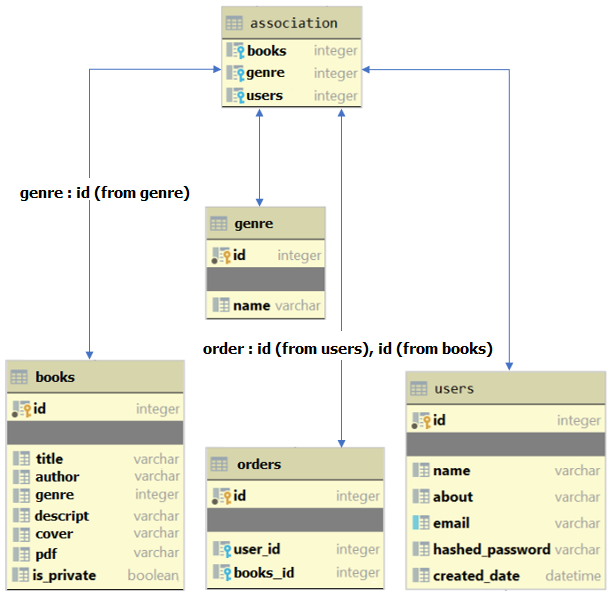

Скачивание книг невозможно без авторизации. Для тестирования в таблице базы данных присутствуют два пользователя:

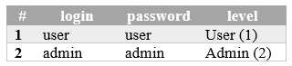

* Admin – имеет уровень – 2 и полные права: как скачивание книг, так и администрирование (добавление жанров, книг, редактирование и удаление). 
* User – может скачивать книги, но не имеет прав доступа к администрированию.

Для авторизации необходимо нажать на кнопку «Войти»

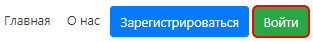

Откроется форма для авторизации (адрес: http://127.0.0.1:5000/login):

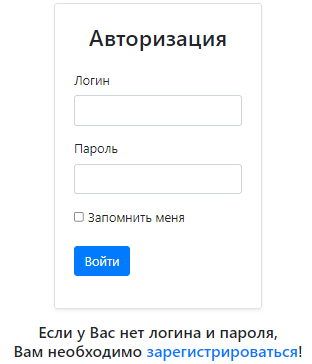

Для начала можно зайти как пользователь и ввести:

Логин: user 
Пароль: user

При выборе галочки (Checkbox) «запомнить меня» пользователь будет авторизован всегда. Даже если будет закрыт обозреватель и выключен компьютер. Если логин или пароль будут введены неверно, пользователь попадает на страницу ошибки авторизации:

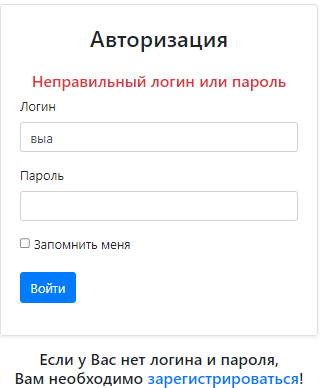

При успешной авторизации кнопки «Зарегистрироваться» и «Войти» сменятся на следующие управляющие ссылки:

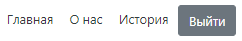

У каждой книге, при этом появится кнопка «Скачать», нажав на которую пользователь может скачать выбранную книгу:

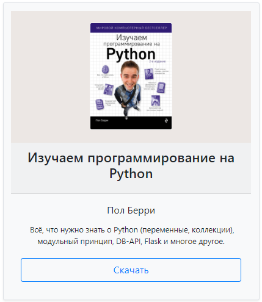

Пользователь не видит адреса на сервере, с которого книга была скачана.
Ему доступна лишь ссылка для скачивания в адресной строке. В истории скачиваний также нет информации, кроме ссылки вида:

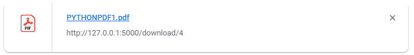

При выборе пункта «История» пользователь попадает на страницу истории скачиваний книг:

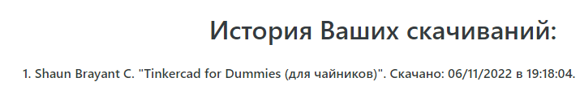

Если ранее ничего не скачивалось, история будет пуста. Кнопка «Выйти» завершает сессию пользователя. Доступ к скачиванию и истории прекращается.
При необходимости, можно зарегистрироваться как новый пользователь:

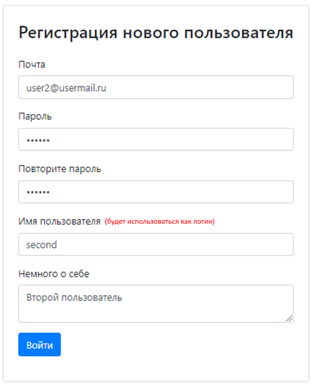

Пользователь добавится в таблицу пользователей со статусом «1» (без административных прав). Администратор, в текущей версии, только один.
Для выбора жанра необходимо воспользоваться выпадающим списком и подтвердить выбор нажатием кнопки «Показать»:

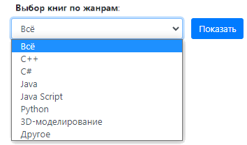

Поиск осуществляется по названию «или» автору. Т.е. запрос формируется по принципу: «поисковый контекст присутствует либо в авторах, либо в названии».
Например (в текущей версии) при вводе слова «Изучаем» (с заглавной буквы), или «изучаем» (с прописной), выведутся три книги:

Если пользователь не авторизован, он не видит кнопки «Скачать» и не может скачивать книги. При попытке же, скачать книгу по прямой ссылке, например: http://127.0.0.1:5000/download/4, он будет перенаправлен на страницу авторизации.

<h3>II. Панель администратора</h3>

Для доступа к панели администратора достаточно в правом нижнем углу (перед footer-ом - «подвалом») нажать на едва заметную ссылку «admin»:

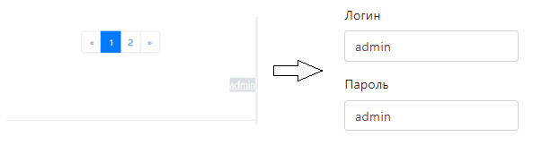

Либо можно перейти по ссылке: http://127.0.0.1:5000/api/admin

*Примечание*: администрирование осуществляется с использованием API.

Доступны следующие действия:
2.1. Добавление, редактирование и удаление категорий книг – жанров;
2.2. Добавление, редактирование и удаление собственно книг.

<h3>2.1. Работа с категориями книг (жанрами)</h3>

Таблица жанров книг выглядит следующим образом:

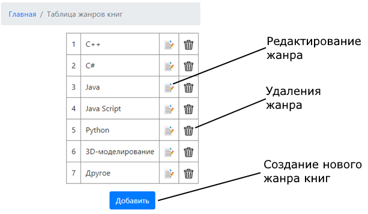

Редактирование наименования категории (жанра) возможно всегда:

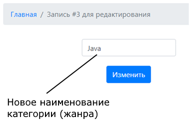

Удаление возможно только если отсутствуют связанные записи (книги) данного жанра. В противном случае удаление невозможно:

Добавление новой категории (жанра) осуществляется по аналогичной схеме:

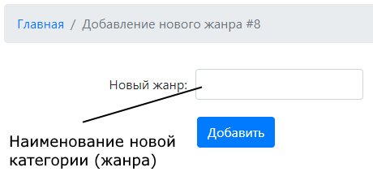

<h3>2.2. Добавление и администрирование книг</h3>

Вид (список) таблицы книг выглядит аналогично жанрам:

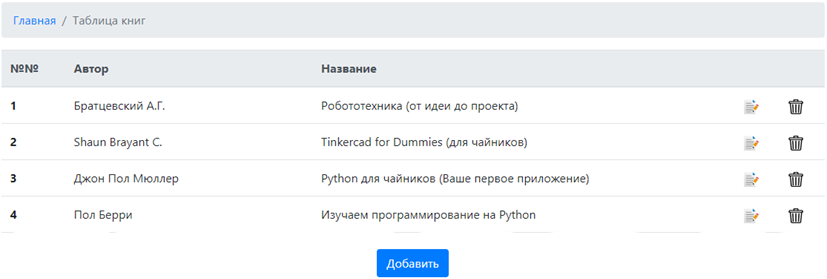

Удаление книги возможно в любой момент. Поскольку операция необратимая, удалению предшествует диалог:

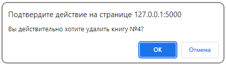

OK – подтверждает операцию. 
Для добавление новой книги необходимо заполнить форму:

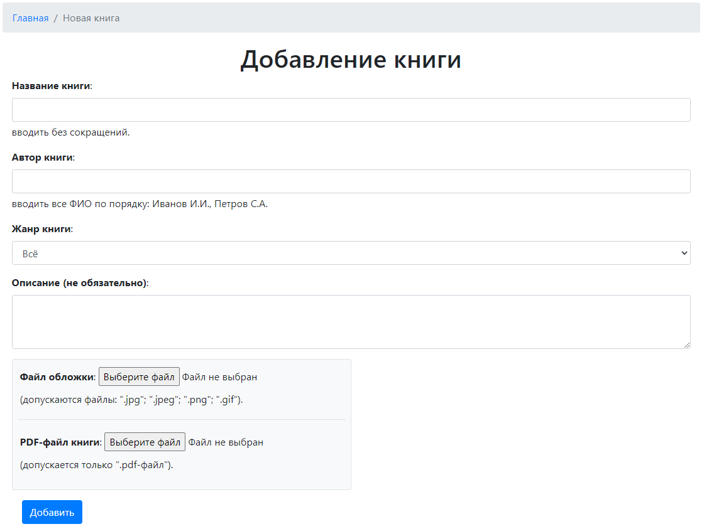

Все поля, кроме «Описание», являются обязательными для заполнения. Инструкция для заполнения на форме присутствует. Жанр книги обязательно необходимо выбрать из выпадающего списка.
Отправка формы осуществляется только при корректном заполнении всех полей. В противном случае появляется сообщение об ошибке, с инструкциями по исправлению:

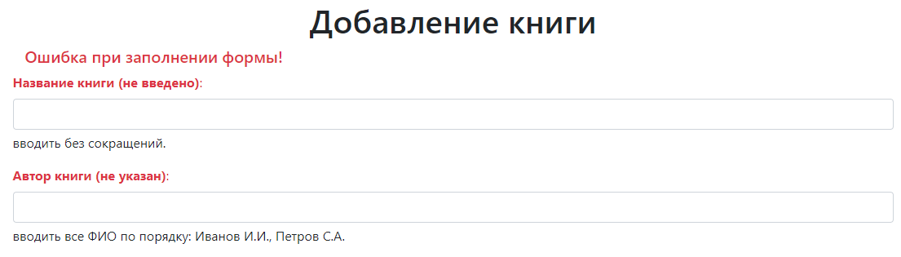

PDF-файл содержит собственно книгу. Поскольку resizing файла обложки, при добавлении, не предусмотрен, необходимо файлу заранее придать размеры (в любом графическом редакторе: Paint и т.д.):
• ширина: 250 ± 50 px;
• высота: 350 ± 50 px (соотношение ширина : высота ≈ ⅔).
При редактировании записи БД (т.е. отдельно взятой книги), форма примет следующий вид:

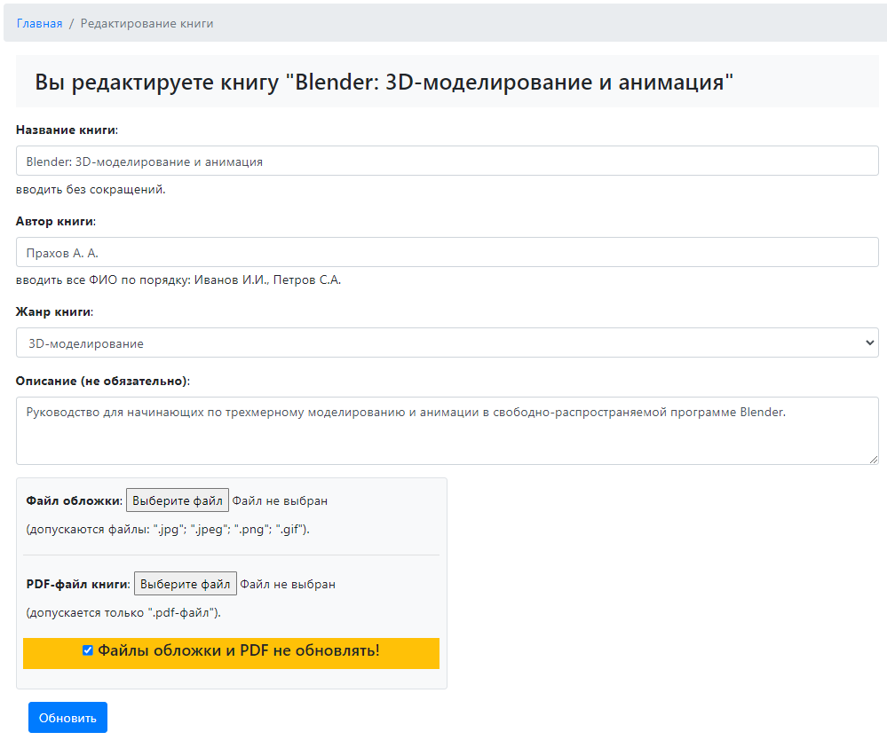

В случае, если редактируется только текстовая информация (название, автор…), необходимо установить «галочку» в checkbox «Файлы обложки и PDF не обновлять» (checked – по умолчанию). Если снять выделение этого пункта, необходимо дополнительно загрузить оба файла (обложку и PDF-файл книги).

Если пользователь не авторизован, то попытка входа в панель администратора (равно, как и попытка скачивания) завершится переадресацией на форму авторизации.
Пользователю вход в панель администрирования закрыт:

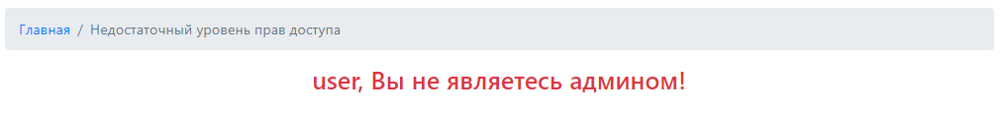

Состав приложения:

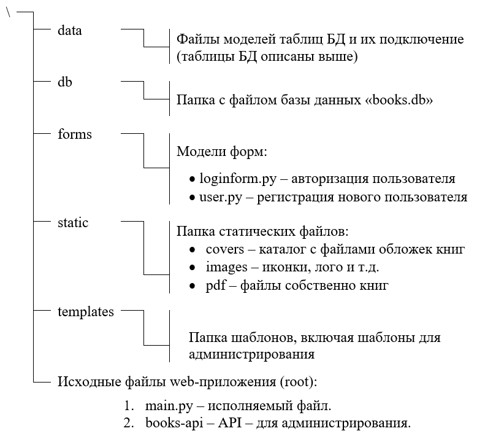

